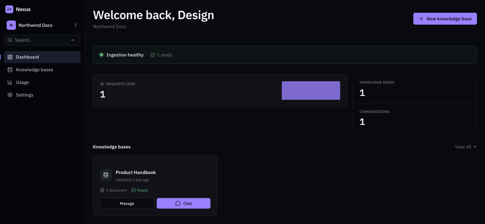
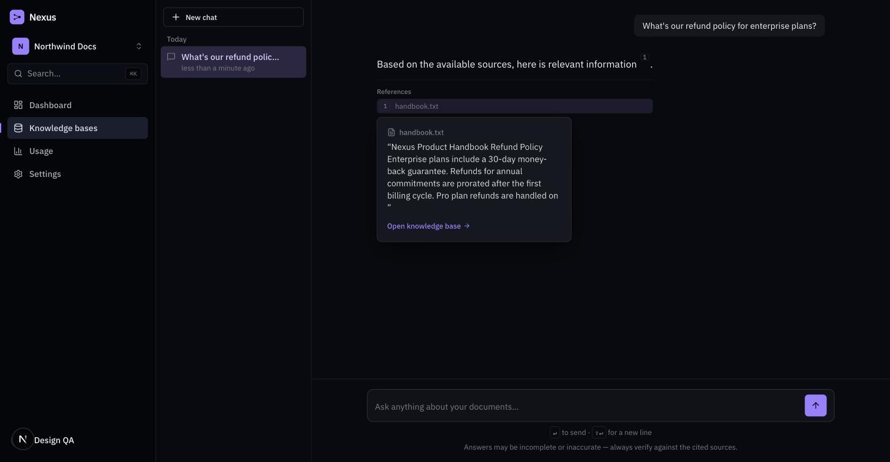
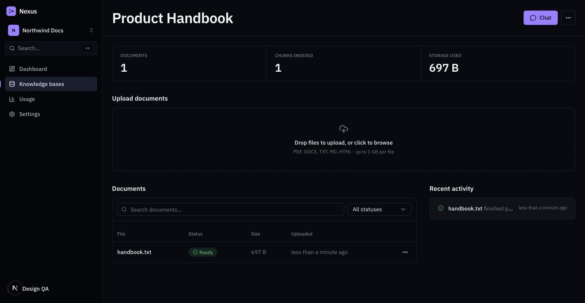

<div align="center">



<h1>Nexus</h1>

<p><strong>The knowledge infrastructure layer for AI.</strong><br />
Upload documents, ship grounded answers with citations, and let Nexus run retrieval, chunking, and embeddings underneath.</p>

<p>
  <a href="https://nexus.chaitanya-bajpai.xyz">Live product</a> ·
  <a href="#local-development">Local development</a> ·
  <a href="#architecture">Architecture</a> ·
  <a href="#security-model">Security</a> ·
  <a href="#roadmap">Roadmap</a>
</p>

</div>

---

## Why Nexus exists

Every team that wants to ship "chat with your docs" ends up rebuilding the same infrastructure: a chunking pipeline, an embeddings job queue, a vector index, retrieval-and-rerank logic, citation verification, multi-tenant data isolation, usage metering, and billing. None of that is the interesting part of the product they're actually trying to build.

Nexus is that infrastructure layer, run as a service. You create a knowledge base, upload documents, and get a chat API (and a dashboard UI) that answers questions grounded in those documents — with citations that are verified against what the model actually retrieved, not just asserted by the model.

It is **not** a chatbot demo. It's built the way you'd build it if you were charging money for it on day one: real multi-tenancy with database-enforced isolation, an async ingestion pipeline with retries and dead-letter handling, streaming responses, metered usage, and a real billing integration.

## Features

- **Multi-tenant knowledge bases** — organizations, workspaces, and role-based membership (owner/admin/member), each knowledge base scoped to its org at the database level.
- **Document ingestion pipeline** — PDF/DOCX/TXT/Markdown/HTML upload via presigned S3/R2 URLs, background extraction → chunking → embedding, with a visible status per document (`QUEUED → EXTRACTING → CHUNKING → EMBEDDING → READY`, or `FAILED` with a surfaced reason and manual retry).
- **Grounded, cited chat** — every answer streams over SSE and links back to the exact source passage it was built from. Citations are verified server-side against what was actually retrieved for that request — a model can't claim a source it wasn't given.
- **Public API + dashboard** — every dashboard action has a matching authenticated API endpoint; scoped API keys let customers integrate retrieval into their own product.
- **Usage metering & billing** — token/request/document usage tracked per organization with daily budgets and rate limits, wired to Paddle for subscription billing (three self-serve tiers plus webhook-driven plan resolution).
- **Real observability** — structured logging, Prometheus-style metrics (HTTP, queue, ingestion, usage), and Sentry error tracking, not console.log.

## Screenshots

<table>
<tr>
<td width="50%"><p align="center"><em>Grounded chat with an open citation popover</em></p></td>
<td width="50%"><p align="center"><em>Knowledge base detail — documents, status, activity</em></p></td>
</tr>
</table>

## Architecture

Turborepo monorepo, three deployables built from the same codebase and scaled independently: the web app can restart without touching ingestion, and the worker pool scales on its own.

```
                         ┌───────────────────────┐
                         │   apps/web (Next.js)    │   dashboard, chat UI, pricing
                         └───────────┬─────────────┘
                                     │ HTTPS (session cookie)
                                     ▼
    External API callers   ┌───────────────────────┐        ┌───────────────────┐
    (API key, Bearer) ────▶│   apps/api (Fastify)    │◀──────▶│      Redis          │
                            └───────────┬─────────────┘        │ queues · rate limits │
              ┌──────────────────────────┼──────────────────────┐  short-lived cache  │
              ▼                          ▼                      ▼  └──────────┬──────────┘
     ┌─────────────────┐      ┌───────────────────┐   ┌──────────────────┐   │
     │  Postgres +       │      │  Object storage     │   │   BullMQ           │◀──┘
     │  pgvector          │      │  (S3 / R2)           │   │   apps/worker       │
     │  system of record  │      │  raw documents        │   │  ingestion pipeline  │
     └─────────┬─────────┘      └───────────────────┘   └──────────┬──────────┘
               │                                                     │
               │                                          ┌──────────▼───────────┐
               │◀─────────────────────────────────────────┤ packages/providers     │
                                                            │ LLM + embeddings        │
                                                            │ OpenAI · Groq · fake     │
                                                            └────────────────────────┘
```

| Component | Responsibility |
|---|---|
| **`apps/web`** | Next.js 15 App Router. Dashboard, KB/document management, streaming chat UI, public marketing site, Paddle-backed pricing/checkout. |
| **`apps/api`** | Fastify HTTP API. Auth, org/KB/document CRUD, chat (retrieval + LLM, streamed over SSE), the public API-key-authenticated surface, enqueues ingestion jobs — never does heavy CPU work inline. |
| **`apps/worker`** | BullMQ workers. Document pipeline (extract → chunk → embed → store), usage rollups, stuck-job sweeps. |
| **`packages/db`** | Prisma schema + client, plus the tenant-context helpers (`withTenantTransaction`) every RLS-enforced query goes through. |
| **`packages/providers`** | LLM + embedding provider abstraction — OpenAI and Groq today, plus a `fake` provider for offline local dev, all behind one interface. |
| **`packages/auth`** | Session JWT + API-key verification shared by `api` and `web`. |
| **`packages/shared`** | Zod schemas and TypeScript contracts shared across all three apps. |
| **`packages/rate-limit`** | Redis-backed token-bucket limiting, tiered by plan and endpoint. |
| **`packages/metrics`** / **`packages/observability`** | Prometheus-style metrics registry and a Sentry error-tracking adapter with a no-op fallback when unconfigured. |

### Data flow

**Ingestion (async, off the request path)**

1. `POST /kb/:id/documents/presign` creates a `Document` row (`PENDING_UPLOAD`) and returns a presigned upload URL.
2. The client uploads bytes **directly to S3/R2** — never proxied through the API process.
3. `POST /kb/:id/documents/:id/complete` verifies the object, sets `QUEUED`, enqueues processing.
4. A worker extracts text, chunks it, embeds the chunks in batches, and writes `DocumentChunk` rows (content + metadata + vector) — status moves to `READY`, or `FAILED` with a reason and a retry action, never silently.

**Chat (sync, latency-sensitive)**

1. `POST /kb/:id/chat` embeds the query with the same model the KB was built with, runs a pgvector similarity search scoped to `organizationId` + `knowledgeBaseId`, and pulls the top candidates.
2. Context is assembled, deduplicated, and packed into a token budget; the LLM is called with a prompt that requires inline citation markers tied to real chunk IDs.
3. The answer streams back over SSE. After generation, every citation marker is checked against the chunk IDs actually placed in context — an unverifiable citation is a bug, not a feature, and is caught server-side before the response is treated as complete.
4. Both turns persist with resolved citations and token usage, for history and billing.

## Tech stack

| Layer | Choice |
|---|---|
| Frontend | Next.js 15 (App Router), React 18, TypeScript, Tailwind CSS v4, Radix UI, framer-motion |
| API | Fastify 5, Zod |
| Workers | BullMQ 5 on Redis |
| Database | PostgreSQL + pgvector, Prisma, row-level security |
| Storage | S3-compatible object storage (S3 / Cloudflare R2) |
| LLM / embeddings | OpenAI, Groq — behind a provider interface; a deterministic `fake` provider for local dev |
| Billing | Paddle (Merchant of Record) |
| Auth | Email + OTP, optional Google OAuth, signed session JWT with Redis-backed revocation |
| Observability | Pino structured logs, Prometheus-style metrics, Sentry |
| Infra | Turborepo + pnpm workspaces, Docker, Railway |

## Local development

Prerequisites: Node ≥20.11, pnpm 9, Docker.

```bash
git clone <repo-url> && cd raas
pnpm install
cp .env.example .env        # see Environment variables below
docker compose up -d        # postgres+pgvector, redis, minio
pnpm --filter @raas/db exec prisma migrate deploy

# each app in its own terminal — root `pnpm dev` exceeds Turbo's default
# task concurrency and will fail; run them individually:
pnpm --filter @raas/api dev
pnpm --filter @raas/worker dev
pnpm --filter @raas/web dev
```

The app is fully usable out of the box with **no external API keys**: `EMBEDDING_PROVIDER=fake`, `LLM_PROVIDER=fake`, and `EMAIL_PROVIDER=fake` are real, deterministic, offline providers (not test mocks) that ship as the local-dev default — sign-up OTPs are logged to stdout instead of emailed, and chat/embeddings work without an OpenAI account.

```bash
pnpm typecheck   # tsc across every package
pnpm lint        # eslint across every package
pnpm test        # vitest — integration tests hit real Postgres/Redis, no mocking
pnpm build       # production build of everything
```

## Environment variables

Everything lives in one root `.env` (see `.env.example` for the fully-documented reference — every variable there explains what it's for and when it's actually required). The shape:

| Group | Required? | Notes |
|---|---|---|
| `DATABASE_URL` / `APP_DATABASE_URL` | Always | Superuser (migrations only) vs. the restricted role RLS is actually enforced against — never the same role. |
| `REDIS_URL` | Always | Queues, rate limiting, session revocation. |
| `SESSION_JWT_SECRET` | Always | HMAC secret for session JWTs. |
| `S3_*` | Always | Endpoint/bucket/credentials — MinIO locally, S3/R2 in staging/prod. |
| `EMBEDDING_PROVIDER` / `LLM_PROVIDER` | Always | `openai` \| `groq` (LLM only) \| `fake`. Real API keys only required when set to a real provider. |
| `GOOGLE_CLIENT_ID` / `GOOGLE_CLIENT_SECRET` | Optional | "Sign in with Google" — simply not registered when unset. |
| `PADDLE_*` (8 vars) | Optional, all-or-nothing | Billing — routes aren't registered at all unless every one of these is set, so a misconfigured subset fails at boot, not at checkout. |
| `SESSION_COOKIE_DOMAIN` | Optional | Only needed when web and api are deployed on different subdomains. |
| `SENTRY_DSN` | Optional | Unset falls back to a no-op error tracker. |
| `RATE_LIMIT_*` | Has defaults | Per-endpoint tuning; production should set these explicitly rather than trust local-dev defaults. |

## Deployment

Each app ships as its own Docker image (`apps/{api,web,worker}/Dockerfile`) and deploys independently — this repo runs on Railway, one service per app plus managed Postgres and Redis.

One thing worth knowing if you deploy this yourself: **`NEXT_PUBLIC_*` variables are inlined into the client bundle at `next build` time**, not read at container runtime. A Docker build is sandboxed from the eventual container's environment, so every `NEXT_PUBLIC_*` var the web app needs has to be threaded through explicitly as a build `ARG` in `apps/web/Dockerfile` — setting it as a platform "environment variable" alone is not sufficient, and the failure mode (a value silently baked in as `undefined`) is easy to ship without noticing.

## Security model

- **Tenant isolation, twice.** Every tenant-scoped query filters on `organizationId` at the application level, *and* Postgres Row-Level Security is enabled as an independent backstop that doesn't depend on application code being correct — see [Row-level security](#row-level-security).
- **API keys** are shown once at creation; only a hash is stored, alongside a visible prefix for identification. Revocation is checked on every request, no cached "valid" state.
- **Sessions** are a signed JWT *and* a live Redis record — a stolen/replayed token stops working the moment the Redis record is deleted, not just at JWT expiry.
- **Uploads never transit the API process.** Clients get a presigned URL and upload straight to object storage; the API only ever sees metadata.
- **Rate limiting** is Redis-backed and tiered: per-IP on auth endpoints (credential-stuffing resistance), per-org/per-user on chat and ingestion.
- **Prompt-injection surface**: retrieved chunk content is always passed as clearly-delimited, explicitly-untrusted context — never concatenated into the system prompt.

## Multi-tenancy

Shared database, shared schema, row-level isolation — not a database-per-tenant or schema-per-tenant model. Every tenant-scoped table carries `organizationId` directly. `Workspace` is a logical grouping *within* an org (teams organize KBs by department); it is not a second isolation boundary — billing, auth, and RLS are all keyed on `organizationId` alone.

## Row-level security

RLS is enabled on every tenant-scoped table as a second, independent enforcement layer on top of application-level filtering:

```sql
ALTER TABLE "DocumentChunk" ENABLE ROW LEVEL SECURITY;
CREATE POLICY tenant_isolation ON "DocumentChunk"
  USING ("organizationId" = current_setting('app.current_org_id')::uuid);
```

`packages/db`'s `withTenantTransaction` sets `app.current_org_id` at the start of every tenant-scoped transaction, derived from the authenticated session or API key — never from a client-supplied field. The application connects as a restricted, non-superuser Postgres role (`raas_app`); the migration-only superuser role is never what the running app authenticates as, because superusers bypass RLS unconditionally regardless of `FORCE ROW LEVEL SECURITY`. This means a missing `where` clause in application code still can't leak another tenant's rows — the database itself refuses to return them.

## Background workers

BullMQ on Redis, with the document pipeline built as a `FlowProducer` (parent job + dependent child jobs) rather than one monolithic function, so a retry re-runs only the stage that failed:

```
process-document (parent)
├── extract-text
├── chunk-text        (depends on extract)
└── embed-chunks × N  (fan-out per batch, depends on chunk-text)
```

Every job is idempotent on its inputs (re-embedding a chunk that already has an embedding is a no-op), so retries are safe rather than dangerous. After max attempts, a job moves to a dead-letter state and `Document.status` becomes `FAILED` with a populated reason — never left ambiguously "processing forever." A scheduled sweep separately catches anything stuck in a non-terminal status past a threshold, so a worker crash mid-job can't strand a document silently.

## Embeddings

One embedding model per knowledge base, fixed at creation (pgvector requires a fixed column dimension, so mixing models within a KB is a real engineering constraint, not a config toggle). Batched per provider call, rate-limited and retried at the provider-abstraction layer rather than scattered across call sites. The `fake` embedding provider used in local dev is deterministic and offline — no OpenAI account needed to run the full pipeline end to end.

## Retrieval

Query embedding uses the same model the KB was built with. Retrieval is a pgvector cosine-similarity kNN query, mandatorily scoped to `organizationId` and `knowledgeBaseId` — the single most security-sensitive line of SQL in the system. Top candidates are deduplicated (chunk overlap can produce near-identical neighbors), ordered by relevance, and greedily packed into a token budget that leaves room for system prompt and chat history.

## Streaming

Chat responses stream over Server-Sent Events from the moment the LLM starts generating — no buffering the full completion before the client sees anything. Citation verification happens after the stream completes, against the exact chunk IDs that were placed in context for that specific request.

## Billing

Paddle, as Merchant of Record. Three self-serve tiers (Starter/Pro/Advanced), monthly or yearly, with live country-localized pricing via Paddle's pricing-preview API and a one-page overlay checkout. A Paddle webhook resolves `subscription.created`/`updated`/`canceled` events to a plan, keyed off which of the six tier/interval price IDs the subscription's line item matches — verified against a real signature (HMAC over the raw request body), not a trusted payload.

## API keys

Created per organization, shown in full exactly once. Only a hash is persisted; a visible prefix lets a customer identify a key in their own systems without ever seeing the raw value again. Revoked keys are rejected immediately — checked on every request, not eventually-consistent.

## Observability

- **Logs**: structured JSON via Pino, one `service` field per process, request IDs threaded through every log line in a request's lifecycle.
- **Metrics**: a Prometheus-style registry covering HTTP request latency/status, queue depth and job outcomes, ingestion throughput, and per-org usage — not ad hoc counters.
- **Errors**: Sentry, behind an adapter that falls back to a no-op tracker when `SENTRY_DSN` is unset, so error tracking is an operational nice-to-have, never load-bearing for the app to start.

## Roadmap

- Bring-your-own-LLM: per-organization OpenAI/Anthropic/Groq keys, encrypted at rest, with connection testing and health status (in progress — see `docs/`).
- Hybrid retrieval (BM25 + vector) for keyword-heavy queries.
- Document-level/KB-level ACLs beyond today's org-level access.
- Reranking as a first-class, configurable pipeline stage (the interface already exists as a no-op pass-through).

---

<div align="center">
<sub>Built as production-grade infrastructure, not a demo.</sub>
</div>
